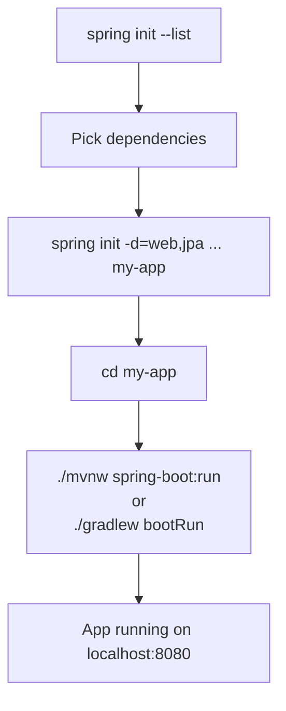

# 🌱 Spring Boot CLI — Create Projects

A quick-reference skill for bootstrapping Spring Boot applications using the **Spring CLI** and `spring init` command, powered by [start.spring.io](https://start.spring.io).

> [!info] Official Docs
> This note is based on the official Spring Boot CLI documentation: [Using the CLI](https://docs.spring.io/spring-boot/cli/using-the-cli.html)

---

## 🔧 Prerequisites

Install the Spring Boot CLI. Once installed, verify it works:

```shell
spring version
# Spring CLI v4.0.6
```

Run `spring` with no arguments to see available commands:

```shell
spring
# Available commands: init, encodepassword, shell
```

---

## 🚀 `spring init` — Initialize a New Project

The `init` command bootstraps a new project using [start.spring.io](https://start.spring.io) without leaving the shell.

### Basic Usage

```shell
spring init [options] [location]
```

### Minimal Example

```shell
spring init
# Creates a default Maven project in the current directory
```

### With Dependencies and Output Directory

```shell
spring init --dependencies=web,data-jpa my-project
# Creates ./my-project with spring-boot-starter-web + spring-boot-starter-data-jpa
```

---

## 📋 Common Options

| Option | Short | Description | Example |
|---|---|---|---|
| `--dependencies` | `-d` | Comma-separated dependency IDs | `-d=web,data-jpa,security` |
| `--build` | | Build system | `--build=gradle` or `--build=maven` |
| `--java-version` | `-j` | Java language level | `--java-version=17` |
| `--packaging` | `-p` | Packaging type | `--packaging=jar` or `--packaging=war` |
| `--group-id` | `-g` | Maven group ID | `-g=com.example` |
| `--artifact-id` | `-a` | Maven artifact ID | `-a=my-app` |
| `--name` | `-n` | Project name | `-n=MyApplication` |
| `--description` | | Project description | `--description="My App"` |
| `--package-name` | | Root package name | `--package-name=com.example.app` |
| `--version` | `-v` | Project version | `-v=0.0.1-SNAPSHOT` |
| `--language` | `-l` | Programming language | `-l=java` |
| `--boot-version` | `-b` | Spring Boot version | `-b=3.2.0` |
| `--extract` | `-x` | Extract the zip archive | `-x` (auto-inferred from dir path) |
| `--force` | `-f` | Overwrite existing files | `-f` |
| `--type` | `-t` | Project type | `-t=gradle-project` |
| `--target` | | Custom Initializr URL | `--target=https://start.spring.io` |

---

## 🧪 Common Command Recipes

### Maven + Web + JPA (default Java)

```shell
spring init -d=web,data-jpa -g=com.example -a=my-app my-app
```

### Gradle + Java 21 + Web + Security, extracted to folder

```shell
spring init --build=gradle --java-version=21 -d=web,security my-app
```

### WAR packaging with WebSocket (zipped)

```shell
spring init --build=gradle --java-version=17 -d=websocket --packaging=war sample-app.zip
```

### Microservice skeleton (Maven, Java 21, actuator + web)

```shell
spring init -d=web,actuator,data-jpa -g=com.myorg -a=user-service \
  --java-version=21 -n=UserService user-service
```

### Full-featured REST API starter

```shell
spring init \
  -g=com.example \
  -a=rest-api \
  -n=RestApi \
  --description="REST API service" \
  --package-name=com.example.restapi \
  --java-version=21 \
  --build=gradle \
  -d=web,data-jpa,security,actuator,validation,lombok \
  rest-api
```

---

## 🔍 Discover Available Dependencies

List all dependencies and project types supported by [start.spring.io](https://start.spring.io):

```shell
spring init --list
```

> [!tip] Filter the list
> Pipe through `grep` to find specific starters:
> ```shell
> spring init --list | grep -i "data"
> ```

### Common Dependency IDs

| ID | Description |
|---|---|
| `web` | Spring MVC + embedded Tomcat |
| `webflux` | Reactive web with Spring WebFlux |
| `data-jpa` | Spring Data JPA + Hibernate |
| `data-mongodb` | Spring Data MongoDB |
| `data-redis` | Spring Data Redis |
| `security` | Spring Security |
| `actuator` | Production monitoring endpoints |
| `validation` | Bean Validation (Hibernate Validator) |
| `lombok` | Lombok annotation processor |
| `devtools` | Spring Boot DevTools (hot reload) |
| `test` | JUnit 5 + Mockito (included by default) |
| `kafka` | Apache Kafka |
| `amqp` | RabbitMQ via Spring AMQP |
| `cloud-eureka` | Eureka discovery client |
| `cloud-gateway` | Spring Cloud Gateway |
| `cloud-config-client` | Spring Cloud Config client |

---

## 🖥️ Embedded Shell

For an interactive shell with tab-completion, useful on Windows or when not using bash/zsh:

```shell
spring shell
# Spring Boot (v4.0.6)
# Hit TAB to complete. Type 'help' and hit RETURN for help, and 'exit' to quit.
```

Inside the shell, run commands without the `spring` prefix:

```shell
# Inside spring shell:
version
init --dependencies=web my-project
```

> [!note] Windows Users
> The embedded shell is particularly useful on Windows since BASH/zsh tab-completion is not natively available.

---

## 🛠️ Workflow: Bootstrap to Running App



---

## 🔗 Related Notes & References

- [start.spring.io](https://start.spring.io) — Web-based project generator
- [Spring Boot Reference Docs](https://docs.spring.io/spring-boot/docs/current/reference/html/)
- [[Spring Boot Concepts]] %%Link if note exists%%
- [[Java Backend Development]] %%Link if note exists%%

> [!tip] Pro Tip
> Combine `spring init` with a shell alias or a script to scaffold opinionated project templates consistently across your team.
